# Ejercicio CRUD con JSP y BBDD

## Introducción

La aplicación web creada para este ejercicio gestiona los juegos de mesa que tienen los usuarios que se registran en la aplicación.
Además de añadir y eliminar juegos, los usuarios podrán modificar sus datos personales y ver los juegos de los dems usuarios.

Por otra parte, el administrador será el encargado de dar de alta los juegos en la base de datos o eliminarlos, además de poder gestionar el alta y borrado de usuarios.

## Base de Datos

## Vistas de la aplicación

Empezamos con el index, el cual nos muestra una ventana de login con contraseña para acceder.
Si nos equivocamos nos muestra un mensaje de error que desaparece con un click.
 
||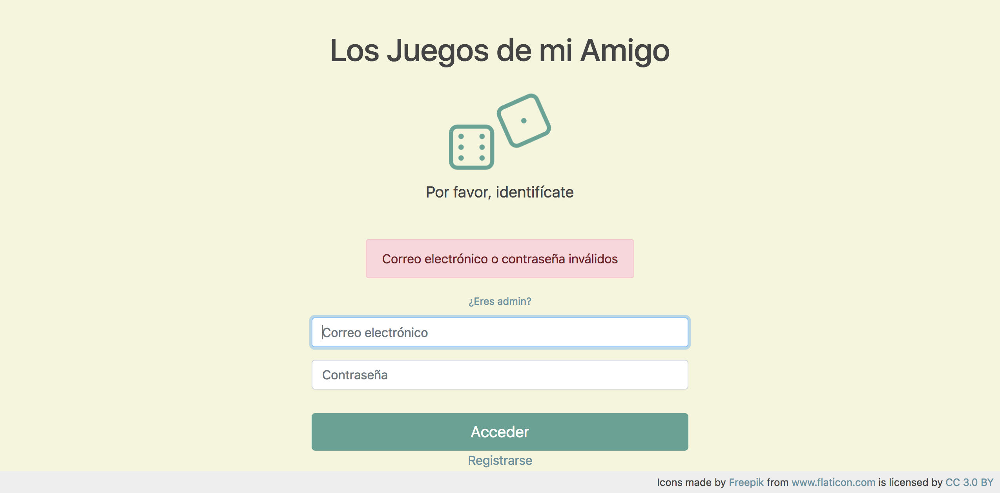|
|-----|--------------|
|Login|Error en Login|

Si accedemos vemos la pantalla principal del usuario, que se divide en 4 zonas diferenciadas.
- La barra de navegación, donde tenemos el buscador, para encontrar amigos por su nombre. Si hacemos click en el nombre, nos 
  llevará a la pantalla del perfil de amigo.
  Además encontramos nuestro nombre de usuario que nos llevará a la patalla que modifica nuestros datos.
  Al lado de nuestro nombre de usuario tenemos el logout.
- A la izquierda nos encontramos la lista de juegos del usuario, que tiene una medida fija, asi que si la superamos, deberemos   hacer scroll para verla completa.
- Derecha superior, muestra el top 3 de amigos con más juegos.
- Derecha inferior, nos permite añadir o eliminar juegos de nuestro perfil.

|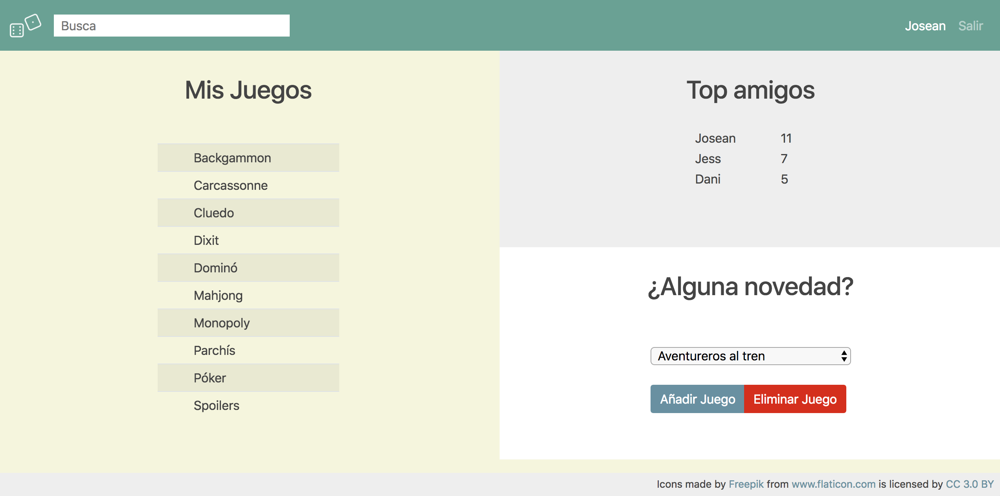|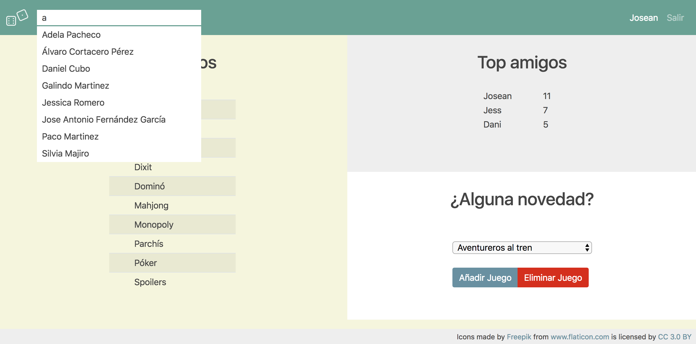|
|---------|--------|
|Principal|Buscador|

|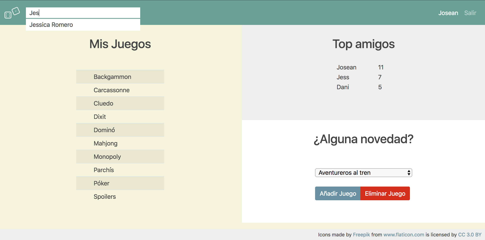|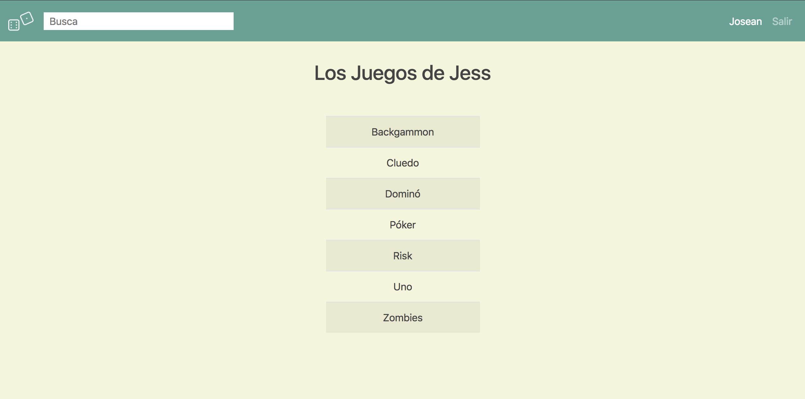|
|---------------|------------|
|Filtrado nombre|Perfil amigo|

Cuando añadimos o eliminamos un juego o modificamos nuestro perfil de usuario, se nos mostrará durante unos segundos un mensaje de confirmación. "Actualizado correctamente"
Si por el contrario, intentamos añadir un juego que ya tenemos o intentamos borrar uno que no tenemos, se nos mostrará un mensaje de error.

|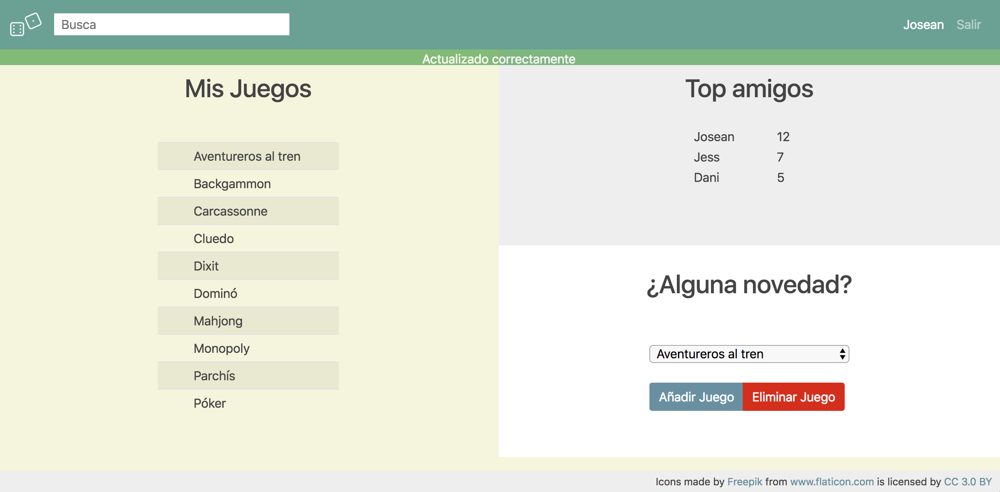|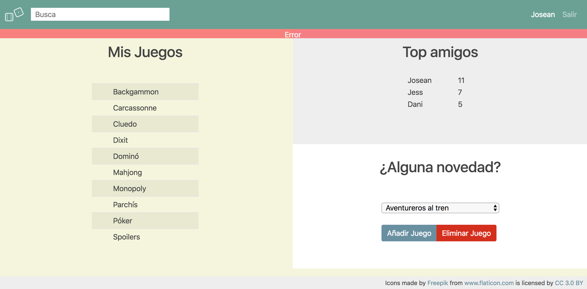|
|-------------------------|-----|
|Actualizado correctamente|Error|

Desde la pantalla de login tenemos la opción de registrarnos, lo que nos llevará a un formulario.
Si el correo electrónico o el usuario están en uso, se nos mostrará un mensaje de error.
Si el registro es correcto, nos enviará a la pantalla de login para poder acceder.

|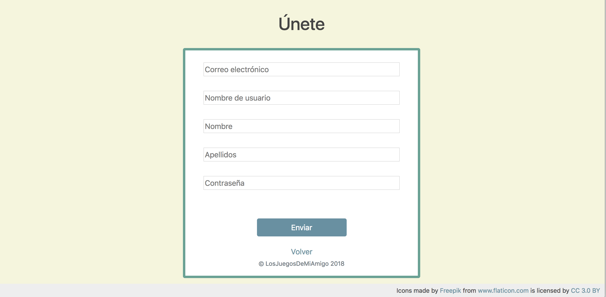|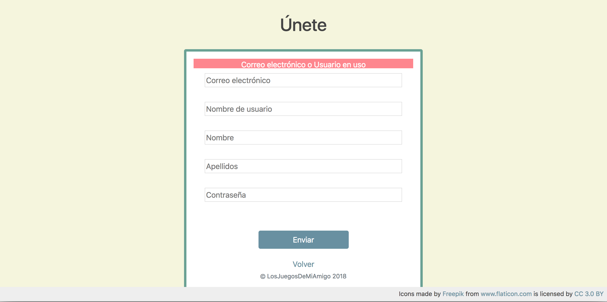|
|-----|-----|
|     |     |

|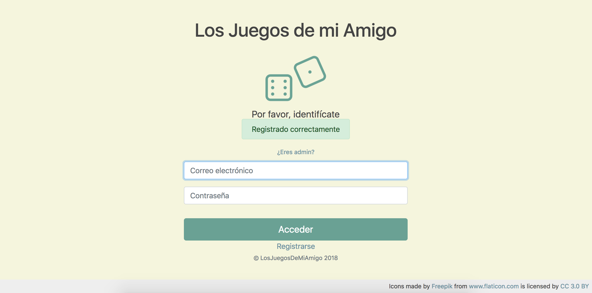|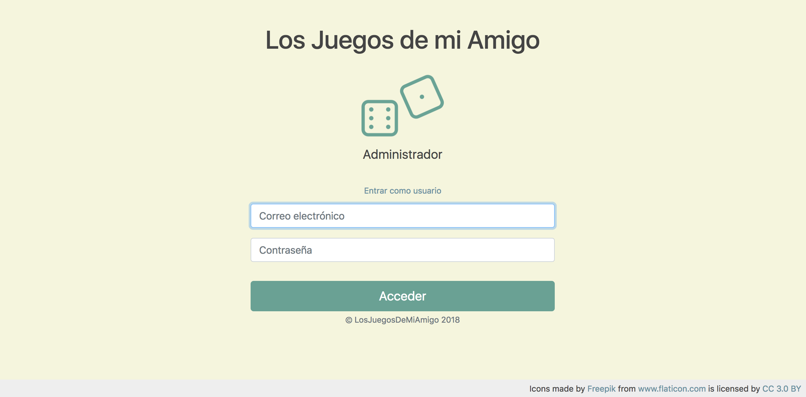|
|-----|-----|
|     |     |

|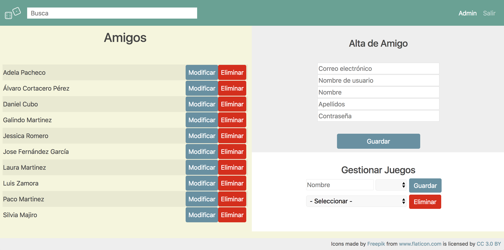|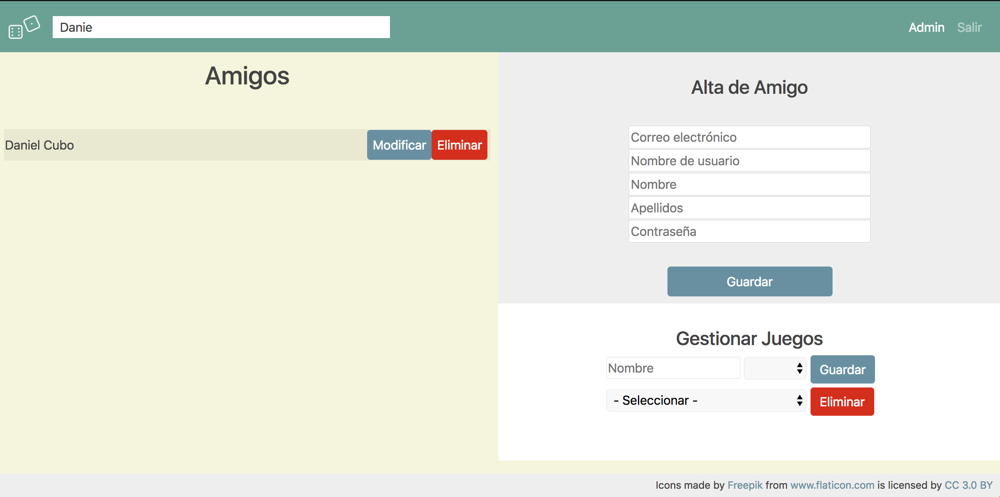|
|-----|-----|
|     |     |

|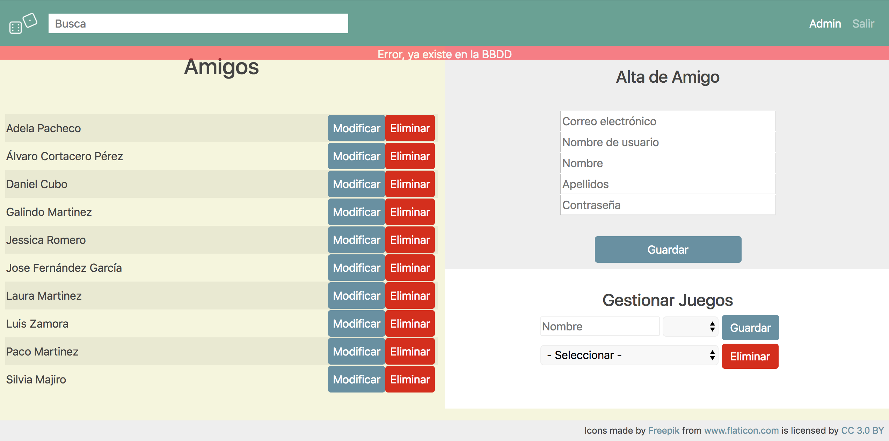| 
|-----|
|     |    

