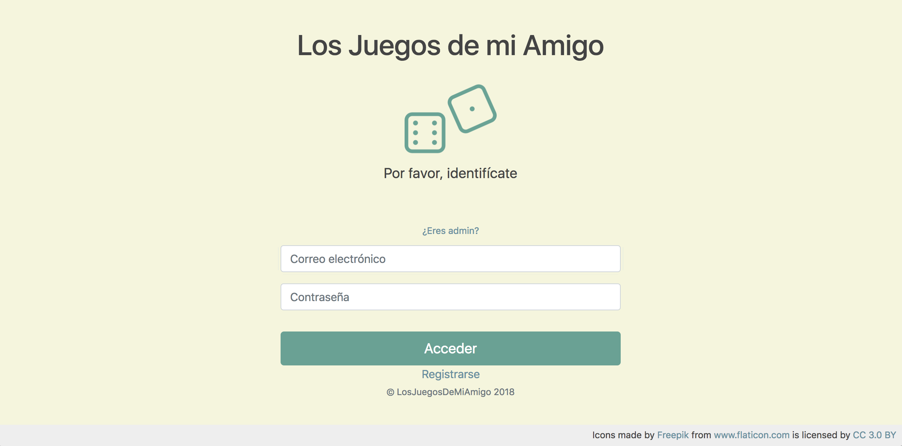

# Ejercicio CRUD con JSP y BBDD

## Introducción

La aplicación web creada para este ejercicio gestiona los juegos de mesa que tienen los usuarios que se registran en la aplicación.
Además de añadir y eliminar juegos, los usuarios podrán modificar sus datos personales y ver los juegos de los dems usuarios.

Por otra parte, el administrador será el encargado de dar de alta los juegos en la base de datos o eliminarlos, además de poder gestionar el alta y borrado de usuarios.

## Base de Datos

## Vistas de la aplicación

